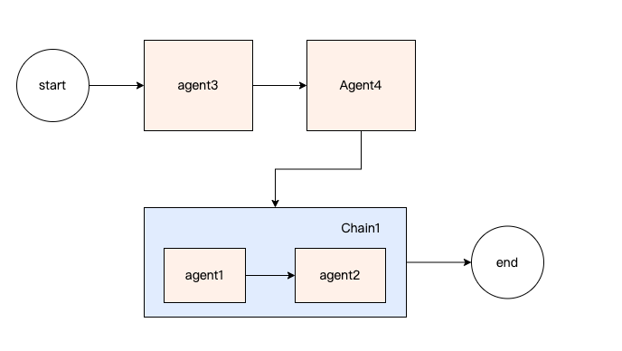

# What is alinesno-smart-model-adapter?

alinesno-smart-model-adapter is an AI application development framework developed in Java, designed to simplify AI application development. It draws inspiration from LangChain, LlamaIndex, and the author's best practices as a frontline AI application developer, providing API support across AI service providers that is portable and not limited to Java development frameworks.

alinesno-smart-model-adapter is suitable for various scenarios, including chat, image generation, embedding models, function calling, and RAG applications, and supports both synchronous and streaming API options.


## Comparison between alinesno-smart-model-adapter and other frameworks

**1、More universally applicable**

Compared to `Spring-AI` and `LangChain4j`, alinesno-smart-model-adapter is more universally applicable.

> 1) For example, `Spring-AI` requires JDK version `JDK 21+` whereas alinesno-smart-model-adapter only needs `JDK8+`.
> 2) `Spring-AI` requires usage within the Spring framework, whereas alinesno-smart-model-adapter supports integration with any framework and provides `spring-boot-starter`.

**2、Simpler API design**

With alinesno-smart-model-adapter, chat functionality can be implemented in just two lines of code.

```java
@Test
public void testChat() {
    OpenAiLlm llm = new OpenAiLlm.of("sk-rts5NF6n*******");
    String response = llm.chat("what is your name?");

    System.out.println(response);
}
```

Function Calling also requires just a few lines of code with alinesno-smart-model-adapter.

```java
public class WeatherUtil {

    @FunctionDef(name = "get_the_weather_info", description = "get the weather info")
    public static String getWeatherInfo(
        @FunctionParam(name = "city", description = "the city name")String name ) {
        //Here, we should retrieve API information through third-party interfaces
        return name + "weather is cloudy with overcast. ";
    }


    public static void main(String[] args) {
        OpenAiLlm llm = new OpenAiLlm.of("sk-rts5NF6n*******");

        FunctionPrompt prompt = new FunctionPrompt("What's the weather like in Beijing today?", WeatherUtil.class);
        FunctionResultResponse response = llm.chat(prompt);

        Object result = response.getFunctionResult();

        System.out.println(result);
        //"The weather in Beijing is overcast turning to cloudy. "
    }
}
```

**2、More Powerful Agents Orchestration**

We know that a powerful AI application often requires flexible orchestration capabilities. Compared to alinesno-smart-model-adapter, `Spring-AI` and `LangChain4j` lack almost any orchestration capabilities.

Below is a simple example code of alinesno-smart-model-adapter regarding Chain (execution chain) orchestration:

```java
public static void main(String[] args) {
    SequentialChain ioChain1 = new SequentialChain();
    ioChain1.addNode(new Agent1("agent1"));
    ioChain1.addNode(new Agent2("agent2"));

    SequentialChain ioChain2 = new SequentialChain();
    ioChain2.addNode(new Agent1("agent3"));
    ioChain2.addNode(new Agent2("agent4"));
    ioChain2.addNode(ioChain1);

    Object result = ioChain2.executeForResult("your params");
    System.out.println(result);
}
```

The above code implements Agents orchestration as shown in the diagram below:



The data flow is as follows: `agent3` --> `agent4` --> `chain1`, and within `chain1`, there is the process of `agent1` --> `agent2`.


In alinesno-smart-model-adapter, we have built-in three different types of Agents execution chains:

- **SequentialChain**: Executes agents sequentially.
- **ParallelChain**: Executes agents concurrently (in parallel).
- **LoopChain**: Executes agents in a loop.

Moreover, each of these three chains can serve as a sub-chain for other chains, thus forming powerful and complex Agents chains.

